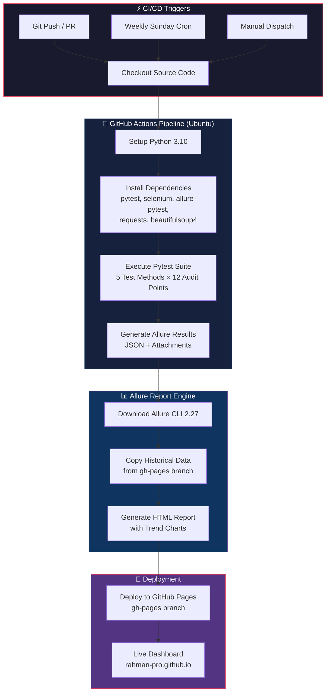
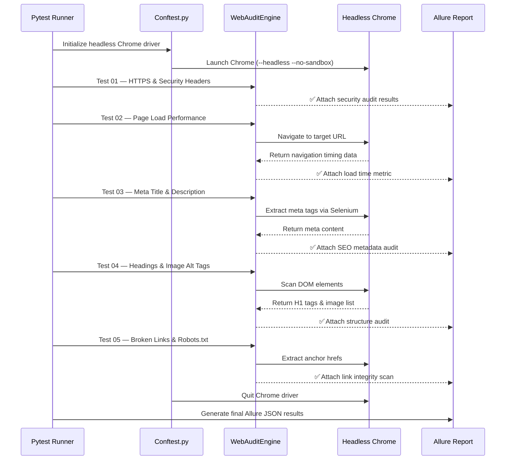
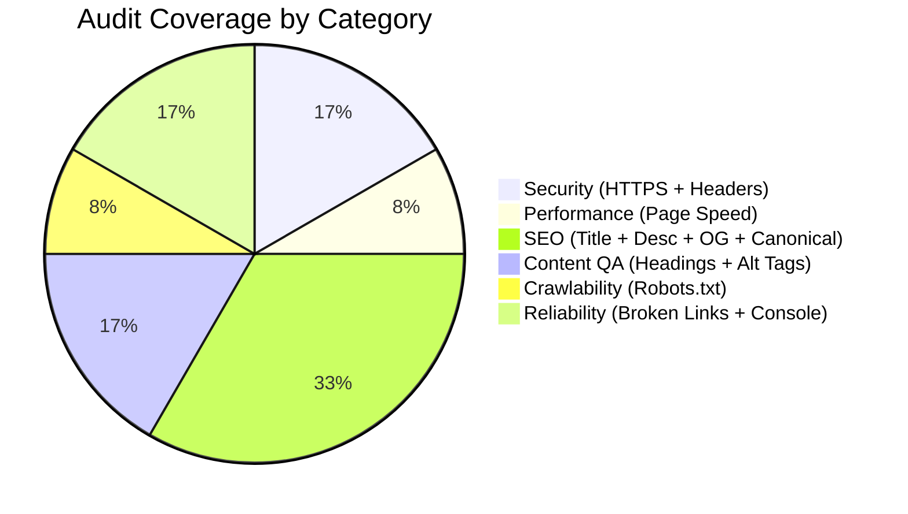

# 🧪 12-Point Web Audit Automation Framework

### Production-Grade SDET Framework — Automated Web Quality Diagnostics with Allure CI/CD Reporting

> Built to enterprise standards by **Atiqur Rahman** — an SDET & QA Automation Engineer who transforms manual web audits into fully automated, CI/CD-integrated, self-documenting test pipelines.


---

## 🌐 Live Interactive Allure Dashboard

View the **live automated Allure execution report** with historical trends, pie charts, and detailed test step breakdowns:

### 👉 [**https://rahman-pro.github.io/web-audit-automation-framework/**](https://rahman-pro.github.io/web-audit-automation-framework/)

---

## 💡 Why This Framework?

| ❌ Without This Framework | ✅ With This Framework |
|:---|:---|
| Manual site audits take **2–4 hours per site** | Automated audit completes in **~60 seconds** |
| Results are scattered in spreadsheets | All results in **one interactive Allure dashboard** |
| No historical comparison between audits | **Historical trend charts** track quality over time |
| Easy to forget running periodic checks | **Automated weekly Sunday cron** via GitHub Actions |
| No evidence trail for client reporting | **Allure attachments** with screenshots & data snapshots |

---

## 📊 Key Metrics

| Metric | Value |
|:---|:---|
| **Total Test Cases** | 5 automated test methods |
| **Audit Diagnostic Points** | 12 technical checks |
| **Average Execution Time** | ~60 seconds (headless) |
| **CI/CD Frequency** | Weekly automated Sunday cron + every push |
| **Report History Retention** | Last 20 runs with trend comparison |
| **Browser Engine** | Google Chrome (Headless) via ChromeDriver |
| **CI Runner OS** | Ubuntu Latest (GitHub Actions) |
| **Deployment Target** | GitHub Pages (gh-pages branch) |

---

## 🏗️ Framework Architecture



---

## 🔬 Test Execution Flow



---

## 🎯 12-Point Technical Audit Coverage



| # | Audit Check | Category | Tool / Method | Validation Logic |
|:---:|:---|:---|:---|:---|
| 1 | **HTTPS Protocol** | 🔒 Security | Python `urllib` | Asserts `https://` prefix on target URL |
| 2 | **Security Headers** | 🔒 Security | Python `Requests` | Checks HSTS, CSP, X-Frame-Options, X-Content-Type |
| 3 | **Page Load Speed** | ⚡ Performance | Selenium `performance.timing` | Navigation Timing API, asserts < 5.0s |
| 4 | **Meta Title** | 🔍 SEO | Selenium `driver.title` | Presence check + 30–65 character guideline |
| 5 | **Meta Description** | 🔍 SEO | Selenium XPath | SERP display limits (70–170 chars) |
| 6 | **H1 Heading Structure** | 📝 Content QA | Selenium `find_elements` | Single primary H1 tag validation |
| 7 | **Image Alt Attributes** | ♿ Accessibility | Selenium tag scan | Missing alt text detection |
| 8 | **Open Graph Tags** | 🔍 Social SEO | Selenium XPath | `og:title`, `og:description`, `og:image` |
| 9 | **Canonical Tag** | 🔍 SEO | Selenium XPath | Valid `<link rel="canonical">` check |
| 10 | **Robots.txt** | 🕷️ Crawlability | Python `Requests` | HTTP 200 response validation |
| 11 | **Broken Links** | 🔗 Reliability | Selenium + `Requests` | HTTP HEAD status code ≥ 400 detection |
| 12 | **Console JS Errors** | ⚠️ Stability | Selenium `get_log("browser")` | SEVERE-level JavaScript exception scan |

---

## 🛠️ Complete Tech Stack

| Layer | Technology | Purpose |
|:---|:---|:---|
| **Language** | Python 3.10+ | Core automation logic |
| **Test Framework** | Pytest 7.4+ | Test discovery, fixtures, markers, parametrize |
| **Browser Automation** | Selenium WebDriver 4.15+ | DOM interaction, navigation, element inspection |
| **Browser Engine** | Google Chrome (Headless) | Automated rendering via ChromeDriver |
| **HTTP Client** | Python Requests | REST API calls, header inspection, link validation |
| **HTML Parser** | BeautifulSoup4 | HTML content parsing and extraction |
| **Reporting** | Allure Framework 2.27 | Interactive HTML reports with steps, attachments, history |
| **CI/CD Platform** | GitHub Actions | Automated test execution on Ubuntu runners |
| **Deployment** | GitHub Pages | Static site hosting for Allure dashboard |
| **Version Control** | Git + GitHub | Source code management and collaboration |

---

## 📁 Repository Structure

```
web-audit-automation-framework/
├── .github/
│   └── workflows/
│       └── main.yml               # GitHub Actions CI/CD pipeline
├── test_web_audit.py              # Pytest suite + embedded WebAuditEngine
├── conftest.py                    # Headless Chrome fixture + Allure screenshot hook
├── requirements.txt               # Python package dependencies
├── .gitignore                     # Excludes cache, allure-results, __pycache__
└── README.md                      # This documentation
```

---

## 🚀 Quick Start Guide

### Prerequisites
- **Python 3.10+** installed ([python.org](https://www.python.org/downloads/))
- **Google Chrome** browser installed

### 1. Clone the Repository
```bash
git clone https://github.com/Rahman-Pro/web-audit-automation-framework.git
cd web-audit-automation-framework
```

### 2. Install Dependencies
```bash
pip install -r requirements.txt
```

### 3. Run the 12-Point Audit Suite
```bash
python -m pytest test_web_audit.py -v --alluredir=allure-results
```

### 4. View Interactive Report (Optional — requires Allure CLI)
```bash
allure serve allure-results
```

---

## 🔄 CI/CD Pipeline (GitHub Actions)

This framework runs automatically via **GitHub Actions** on **Ubuntu Latest**:

| Trigger | When |
|:---|:---|
| `push` | Every commit to `main` / `master` branch |
| `pull_request` | Every PR targeting `main` / `master` |
| `schedule` | **Weekly Sunday at midnight UTC** (`cron: '0 0 * * 0'`) |
| `workflow_dispatch` | Manual trigger from GitHub Actions UI |

### Pipeline Steps:
1. ☑️ Checkout source code
2. ☑️ Setup Python 3.10 environment
3. ☑️ Install pip dependencies
4. ☑️ Execute Pytest suite with Allure output
5. ☑️ Install Allure CLI 2.27
6. ☑️ Merge historical test data from gh-pages
7. ☑️ Generate interactive HTML report
8. ☑️ Deploy to GitHub Pages (`gh-pages` branch)

---

## 👨‍💻 About the Author

### **Atiqur Rahman** — SDET & QA Automation Engineer

Specializing in designing and building **enterprise-grade test automation frameworks**, **CI/CD pipelines**, and **quality engineering solutions** for web applications.

| | |
|:---|:---|
| 🔗 **LinkedIn** | [**linkedin.com/in/atiqur-rahman-pro**](https://www.linkedin.com/in/atiqur-rahman-pro/) |
| 🐙 **GitHub** | [**github.com/Rahman-Pro**](https://github.com/Rahman-Pro) |

### Core Competencies
`Python` `Java` `Pytest` `Selenium WebDriver` `Playwright` `Rest Assured` `Allure Reports` `GitHub Actions` `CI/CD Pipelines` `API Testing` `Performance Testing` `Web Automation` `Cross-Browser Testing` `BDD/TDD` `Agile/Scrum`

---

<p align="center">
  <b>⭐ Star this repository if you found it useful! ⭐</b>
</p>
